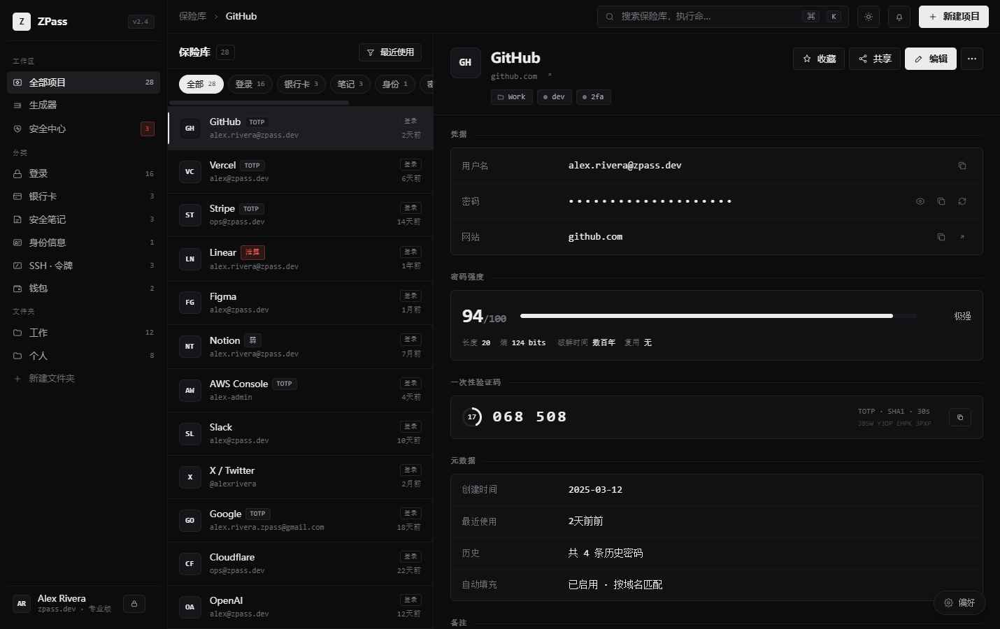

<div align="center">

# ZPassDesign

**ZPass 视觉与交互设计原型集**

零构建 · 单文件运行 · 实时主题调节

`React 18` · `Babel Standalone` · `Geist`

</div>

---

## 概览

`ZPassDesign` 是 ZPass 密码管理器的高保真交互原型，用于在工程实现之前锁定**视觉语言、信息架构与交互细节**。所有原型均通过浏览器直接打开运行，无需安装、无需构建。

```
ZPassDesign/
├── ZPass.html               桌面端应用原型
├── ZPass-Mobile.html        移动端应用原型 (iOS / Android)
├── ZPass-Mobile-Canvas.html 移动端 Figma 风格设计画布
├── ZPass-Site.html          官网营销页原型
├── ZPass-Promo.html         30s 品牌宣传动画
├── animations.jsx           动画运行时 (Stage / Timeline / Sprite)
├── screenshots/             效果截图
└── src/
    ├── tokens.css           设计令牌 (颜色 / 字号 / 圆角 / 阴影)
    ├── data.jsx             模拟数据 (vault / breaches / activity)
    ├── i18n.jsx             中英双语字符串
    ├── icons.jsx            线性图标库
    ├── ui.jsx               基础组件 (Toast 等)
    ├── unlock.jsx           解锁页
    ├── vault.jsx            保险库列表
    ├── detail.jsx           条目详情
    ├── generator.jsx        密码生成器
    ├── health.jsx           安全中心
    ├── cmdk.jsx             ⌘K 命令面板
    ├── tweaks.jsx           主题调节面板
    ├── app.jsx              桌面端组合根
    ├── mobile/              移动端组件 (zp-*.jsx + 设备外框)
    └── site/                官网组件 (site-app + site-i18n)
```

---

## 快速开始

```sh
# 任意静态服务器即可，例如：
python -m http.server 8000
# 或
npx serve .
```

随后浏览器访问对应入口：

| 入口 | 用途 |
|---|---|
| [`ZPass.html`](./ZPass.html) | 桌面应用全功能原型 |
| [`ZPass-Mobile.html`](./ZPass-Mobile.html) | 移动端 iOS / Android 切换预览 |
| [`ZPass-Mobile-Canvas.html`](./ZPass-Mobile-Canvas.html) | 多画板设计稿（支持双指缩放 / 拖拽） |
| [`ZPass-Site.html`](./ZPass-Site.html) | 官方网站营销页 |
| [`ZPass-Promo.html`](./ZPass-Promo.html) | 品牌宣传短片 |

> 直接 `file://` 打开亦可运行，但部分浏览器会拦截跨源 `.jsx` 加载，建议使用本地服务器。

---

## 设计语言

### 色彩

| Token | Dark | Light |
|---|---|---|
| `--bg`         | `#0c0c0d` | `#f5f5f3` |
| `--bg-elev`    | `#111113` | `#fbfbf9` |
| `--line`       | `#232328` | `#e1e1dd` |
| `--text`       | `#ececec` | `#141416` |
| `--accent`     | 中性白 / 可选 lime `#d4ff3a` | 中性黑 / 可选 olive `#8ab10f` |
| `--danger`     | `#e55a4a` | `#b53d2b` |
| `--ok`         | `#5ea47a` | `#35734f` |

### 字体

- **Sans** — `Geist` (300 / 400 / 500 / 600 / 700)
- **Mono** — `Geist Mono` (400 / 500 / 600) · 用于密码、TOTP、键盘快捷键

### 几何

- 圆角 `5 / 7 / 10 / 14 px` — 克制，不追求拟物
- 描边优先于填充，分隔靠 `--line` 而非阴影
- 密度三档 `compact / normal / comfy` 通过 `--dens-row` 切换

---

## 技术架构

### 零构建运行时

所有原型遵循同一加载模式：

```html
<script src="https://unpkg.com/react@18.3.1/..."></script>
<script src="https://unpkg.com/@babel/standalone@7.29.0/..."></script>
<script type="text/babel" src="src/data.jsx"></script>
<script type="text/babel" src="src/app.jsx"></script>
```

`.jsx` 由 Babel Standalone 在浏览器内即时编译，**保存即刷新**，无需 webpack / vite / 任何 node 依赖。

### 模块通信

各源文件挂载到 `window.ZPASS_*` 全局命名空间互通：

```
window.ZPASS_DATA   — ITEMS / BREACHES / ACTIVITY / FAVICONS
window.ZPASS_I18N   — STRINGS / I18nProvider / useI18n
window.ZPASS_ICONS  — 线性图标集合
window.ZPASS_UI     — ToastProvider 等基础组件
window.ZPASS_Unlock / VaultList / Detail / Generator / Health / CmdK / Tweaks
```

### EDITMODE 持久化

每个原型顶部都有一个 `EDITMODE` 块，用于设计走查时锁定默认状态：

```jsx
const TWEAK_DEFAULTS = /*EDITMODE-BEGIN*/{
  "theme": "dark",
  "accent": "#d4ff3a",
  "density": "normal",
  "lang": "en"
}/*EDITMODE-END*/;
```

外部脚本可通过正则替换该块批量生成不同主题截图。

---

## 交互特性

- **⌘K / Ctrl+K** — 命令面板，模糊搜索 + 跳转 + 快捷动作
- **⌘L / Ctrl+L** — 一键锁定保险库
- **Travel Mode** — 旅行模式，自动隐藏标记为 `hidden` 的敏感条目并显示统计横幅
- **Tweaks 面板** — 右下角浮按，实时切换主题 / 口音色 / 密度 / 字体 / 语言
- **TOTP** — 动态码 30s 倒计时进度环
- **Strength Meter** — 基于熵值的密码强度分级（弱 / 中 / 强）
- **Timeline** — 条目历史时间轴（创建 / 使用 / 修改 / 共享 / 添加 TOTP）
- **Breach Feed** — 数据泄露事件流，按严重等级分级染色

---

## 移动端设计画布

`ZPass-Mobile-Canvas.html` 提供 Figma 风格的无限画布：

- **平移** — 双指拖拽 / 鼠标中键 / 空白处拖动
- **缩放** — 双指捏合 / `Ctrl + 滚轮`
- **画板** — iOS 与 Android 设备外框并排展示所有屏幕

DOM transform 通过 `ref` 直写绕过 React，保证密集画板下平移仍维持 60 fps。

---

## 国际化

`src/i18n.jsx` 提供 `en` / `zh` 双语字典，移动端在 `MOBILE_STRINGS` 中追加键值合并入主字典：

```jsx
Object.keys(MOBILE_STRINGS).forEach(lang => {
  Object.assign(window.ZPASS_I18N.STRINGS[lang], MOBILE_STRINGS[lang]);
});
```

语言选择持久化到 `localStorage.zpass.lang`。

---

## 截图

<div align="center">



</div>

---

## 设计原则

> **平静** — 默认中性白/黑作为主色，避免品牌色喧宾夺主。
>
> **诚实** — 用线条而非投影分隔，密度由内容决定，不堆砌装饰。
>
> **可控** — 所有主观参数（色、字、密度）均开放给用户实时切换。
>
> **零知识** — 视觉上反复强化"本地解密、服务端不可见"的心智模型。

---

<div align="center">

设计原型 · 非生产代码

</div>